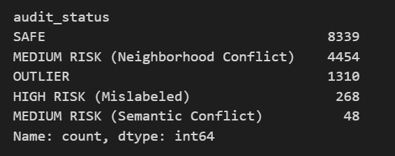

# Data Label Auditor for Sentiment Datasets

## Project Overview

This project builds a **data auditing pipeline for sentiment datasets** that detects **potentially mislabeled text samples** using semantic embeddings and clustering.

Instead of directly training models on noisy labels, the system focuses on **improving dataset quality** by identifying samples whose assigned sentiment label conflicts with their **semantic meaning or cluster context**.

The pipeline surfaces **high-risk samples for human review**, helping reduce label noise before training machine learning models.

---

# Dataset

The project uses the **Twitter US Airline Sentiment Dataset**.

Twitter US Airline Sentiment Dataset

| Property         | Value                         |
| ---------------- | ----------------------------- |
| Total tweets     | 14,419                        |
| Sentiment labels | positive / neutral / negative |
| Domain           | Airline customer feedback     |

---

# Pipeline Overview

```
Raw Tweets
   │
   ▼
Text Cleaning
   │
   ▼
Sentence Embeddings
   │
   ▼
Dimensionality Reduction (UMAP)
   │
   ▼
Clustering (HDBSCAN)
   │
   ▼
Cluster Label Consistency Check
   │
   ▼
Cross-Encoder Semantic Validation
   │
   ▼
Risk Classification
   │
   ▼
Flagged Samples for Review
```

---

# Stage 1 — Text Cleaning

Tweets often contain noise such as URLs, HTML entities, and irregular spacing.
A preprocessing pipeline removes these artifacts and normalizes the text.

Cleaning ensures that the embedding model focuses on **semantic meaning rather than formatting noise**, improving the quality of downstream clustering.

---

# Stage 2 — Sentence Embeddings

Each tweet is converted into a **dense semantic vector** using
SentenceTransformers (model: `all-mpnet-base-v2`).

These embeddings capture the **semantic meaning of the sentence**, allowing texts with similar sentiment or context to appear close together in vector space.

This step transforms raw text into a representation suitable for **semantic analysis and clustering**.

---

# Stage 3 — Dimensionality Reduction

The embeddings are high-dimensional, which makes clustering difficult.
To address this, embeddings are reduced using
UMAP.

UMAP preserves the **local structure of semantic neighborhoods**, making it easier to identify groups of similar tweets while keeping computational cost manageable.

---

# Stage 4 — Clustering

The reduced embeddings are grouped using
HDBSCAN.

HDBSCAN identifies **natural clusters of semantically similar tweets** without requiring a fixed number of clusters.
It also detects **outliers**, which are tweets that do not fit well into any semantic group.

Hyperparameters are optimized using
Optuna.

---

# Stage 5 — Cluster Label Consistency Check

Within each cluster, the **majority sentiment label** is computed.
Tweets whose labels differ from the majority label are marked as **minority samples**.

These tweets are potential label inconsistencies because their sentiment **does not match the dominant sentiment of semantically similar tweets**.

---

# Stage 6 — Cross-Encoder Semantic Validation

Suspicious samples are further evaluated using a cross-encoder model:

cross-encoder/ms-marco-MiniLM-L-6-v2

The model compares the tweet against sentiment descriptions and produces similarity scores.
This provides a **semantic second opinion**, verifying whether the dataset label aligns with the meaning of the text.

---

# Stage 7 — Risk Classification

A confidence margin is computed between the assigned label score and the best alternative label score.

Tweets are categorized into **SAFE, OUTLIER, MEDIUM RISK, or HIGH RISK** depending on cluster context and semantic disagreement.

High-risk samples are flagged as **potentially mislabeled** and recommended for human review.

---

# Results

| Metric                    | Value         |
| ------------------------- | ------------- |
| Dataset size              | 14,419 tweets |
| Clusters discovered       | ~37           |
| Outliers                  | ~2–3%         |
| High-risk samples flagged | 268           |

The pipeline reduces the dataset to **~1.8% suspicious samples**, allowing efficient manual auditing instead of reviewing the entire dataset.

Model Output :

---
# Key Advantages of This Approach

Detects **label inconsistencies automatically**

Reduces manual review effort by **98%**

Combines **unsupervised learning and semantic validation**

Demonstrates a **data-centric AI workflow**

Helps improve **dataset quality before model training**

---

# How to Run the Project

## 1 Clone Repository

```bash
git clone https://github.com/Tushika2024/data_label_auditor.git
cd data-label-auditor
```

---

## 2 Install Dependencies

```
pip install sentence-transformers
pip install umap-learn
pip install hdbscan
pip install optuna
pip install scikit-learn
pip install pandas numpy matplotlib seaborn
```

---

## 3 Run the Notebook

Open and run:

```
LABEL_AUDITOR.ipynb
```

The pipeline will generate:

```
high_risk_airline_audit_complete_final(1).csv
```

---

# Tools Used

* Python
* Pandas
* NumPy
* Scikit-learn
* SentenceTransformers
* UMAP
* HDBSCAN
* Optuna

---

# Future Improvements

Possible extensions include:

* human-in-the-loop annotation interface
* active learning for automatic relabeling
* evaluation across multiple sentiment datasets
* integration into ML data pipelines

---

